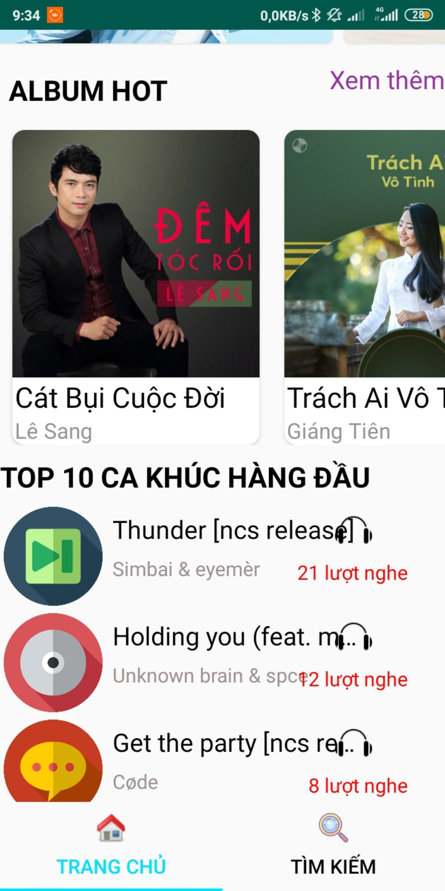
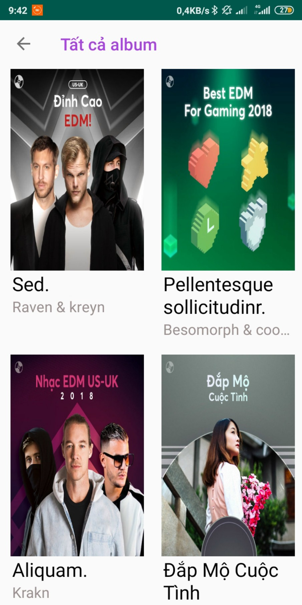

# PHẦN I: TỔNG QUAN ĐỀ TÀI
## 1. Giới thiệu đề tài

Ngày nay, nhu cầu giải trí, thư giãn là rất cần thiết đối với mỗi chúng ta sau những giờ làm việc, học tập căng thẳng. Một trong số những cách tốt nhất giúp chúng ta thoải mái đó chính là nghe nhạc. Nắm bắt được điều đó, việc tạo ra một ứng dụng nghe nhạc tiện lợi,  giúp chúng ta thư thả, tận hưởng những giai điệu một cách tốt nhất là một vấn đề cần được quan tâm.
Ứng dụng nghe nhạc sẽ giúp chúng ta dễ tìm kiếm bài hát yêu thích, giao diện dễ dùng, gần gũi. Từ đó, bạn có thể thư giản,  thoải mái ca hát đề giảm đi mệt mỏi, căng thẳng hàng ngày. 

   

#  PHẦN II: NỘI DUNG
1. [Chức năng](#chức-năng)

   1. [Trang Chủ](#Trang-Chủ)

   1. [Trang Phát Nhạc](#Trang-Phát-Nhạc)

   1. [Trang bài hát](#Trang-Phát-Nhạc)

   1. [Trang Tìm Kiếm](#Trang-Tìm-Kiếm)
   
1. [Yêu cầu thiết bị](#yêu-cầu-thiết-bị)

1. [Thư viện và công nghệ](#thư-viện-và-công-nghệ)

1. [Tác giả](#tác-giả)

1. [Giấy phép](#giấy-phép)

## Chức năng
### Trang Chủ
* Phân loại bài hát:
+ Hiển thị các thể loại ví dụ như: Bolero, EDM, Acoustic…Khi chọn vào chủ đề nào sẽ thị danh sách bài hát theo thể loại đó.
+ Hiển thị các Album của các ca sĩ. Khi chọn vào Album nào sẽ thị danh sách bài hát theo Album đó.
+ Hiển thị các chủ đề ví dụ như: Thư giản, Tình Yêu, Tâm Trạng…Khi chọn vào chủ đề nào sẽ thị danh sách bài hát theo chủ đề đó.
+ Hiển thị các Playlist. Khi chọn vào Playlist nào sẽ thị danh sách bài hát theo Playlist đó.
* Thống kê lượt nghe: Hiển thị Top 10 bài hát có lượt nghe nhiều nhất.
* Quảng cáo: Quảng cáo các bài hát với những nội dung hấp dẫn. Khi chọn vào quảng cáo sẽ dẫn vào trang phát nhạc bài hát đó.

   

* Trang chủ là 1 ScrollView để hiển thị các nội dung:
+ Quảng cáo các bài hát.

   

+ Phân loại bài hát theo playlist.

    

+ Phân loại bài hát theo album.

    

+ Phân loại bài hát theo chủ đề - thể loại.

    

+ Danh sách các album.

    

+ Top 10 ca khúc có lượt nghe nhiều nhất.

   

### Trang Phát Nhạc
Bao gồm 2 tab: Điều chỉnh nhạc và hiển thị danh sách bài hát.
* Tab Điều chỉnh nhạc: Hiển thị giao diện đĩa nhạc, thời lượng bài hát với các nút điều chỉnh nhạc như: Shuffle(phát ngẫu nhiên), Repeat(phát lặp lại), Pause(Tạm dừng Next(Chuyển sang bài kế tiếp), Previous(Chuyển lại bài trước đó).
* Hiển thị danh sách đang phát: Cho biết các bài hát đang trong danh sách phát nhạc.
* Hẹn giờ: Cài đặt thời gian tắt nhạc.
* Tab Danh sách bài hát: Hiển thị danh sách các bài hát đang phát. Chúng ta có thể click vào bài hát muốn nghe trong danh sách để phát.

    
   

### Trang bài hát
Trang bài hát: 
* Hiển thị danh sách các bài hát và lượt nghe của từng bài. Chúng ta có thể chọn nghe từng bái hát bằng cách click vào từng dòng hoặc nghe tất cả bài hát với việc chọn icon đĩa nhạc trên cùng.

   
   

### Trang Tìm Kiếm
Trang tìm kiếm: Tìm kiếm với từ khóa được cung cấp và phân loại kết quả theo
* Bài hát
* Album
* Thể loại
* Playlist
* Chủ đề

   
   

* Tìm kiếm từ khóa "Tình"

     
   

   
## Yêu cầu thiết bị
-Android:

   +Android studio : 3.0.1

   +Gradle : 4.1

   +Min sdk : 19

   +Target sdk : 26

## Thư viện và công nghệ

- Language : Javascript

- FrameWork : React Native 0.55.4

- Database: phpMyAdmin

* react-native - https://github.com/facebook/react-native

* react-navigation - https://github.com/react-navigation/react-navigation

* react-native-maps - https://github.com/react-native-community/react-native-maps

* react-native-swiper - https://github.com/leecade/react-native-swiper

* react-native-linear-gradient - https://github.com/react-native-community/react-native-linear-gradient

* react-native-view-more-text - https://github.com/nlt2390/react-native-view-more-text

## Tác giả
Cao Thành Tâm - 14520789@gm.uit.edu.vn

Trần Trọng Tiến - 17521133@gm.uit.edu.vn

## Giấy phép

    Copyright 2014

    Licensed under the Apache License, Version 2.0 (the "License");
    you may not use this file except in compliance with the License.
    You may obtain a copy of the License at

       http://www.apache.org/licenses/LICENSE-2.0

    Unless required by applicable law or agreed to in writing, software
    distributed under the License is distributed on an "AS IS" BASIS,
    WITHOUT WARRANTIES OR CONDITIONS OF ANY KIND, either express or implied.
    See the License for the specific language governing permissions and
    limitations under the License.

# PHẦN III: TỔNG KẾT

## 1 Kết quả đạt được

- Trong đồ án nhóm đã vận được các kiến thức đã học từ môn Phát triển ứng dụng trên thiết bị di động như:
+ Activity Life Cycle
+ Cách thức hoạt động của các View, ViewGroup.
+ Kết nối cơ sở dữ liệu MySQL.
+ Truy vấn dữ liệu bằng LINQ
- App nghe nhạc đáp ứng được các yêu cầu đặt ra ban đầu:
+ Giúp cho người dùng xem và tìm kiếm được bài hát nhanh nhất.
+ Giao diện đơn giản, dễ dùng.
+ Hỗ trợ đặt thời gian phát nhạc.

## 2 Hạn chế

- Do chưa có nhiều kinh nghiệm trong việc xây dựng trang app mobile nên còn một số vấn đề như sau:
+ Giao diện chưa được chỉnh chu, không bắt mắt với người dùng.
+ Chưa xử lý phần nghe nhạc khi tắt app.

## 3 Hướng phát triển

- Nhằm khắc phục những hạn chế cũng như hoàn thiện app nhóm xin đưa ra các đề xuất như sau:
+ Cân chỉnh lại giao diện, thêm các hiệu ứng/ màu sắc phù hợp.
+ Tiếp tục hoàn thiện chức năng phát nhạc trên nền(background).
+ Mở rộng thêm chức năng như: download, upload, đánh giá bài hát...
"# Nhom28" 
